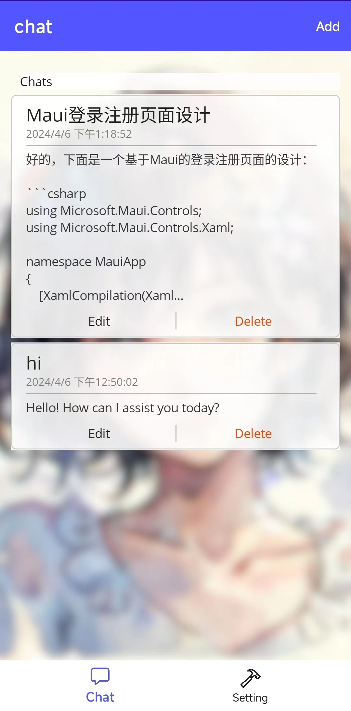
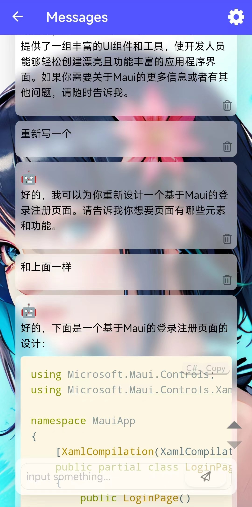
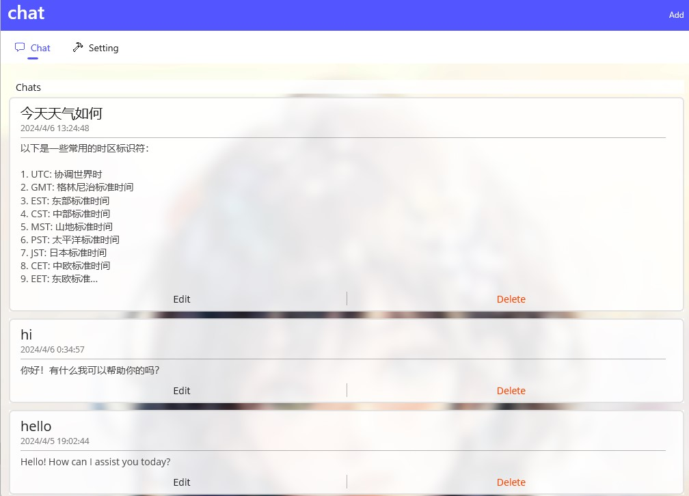
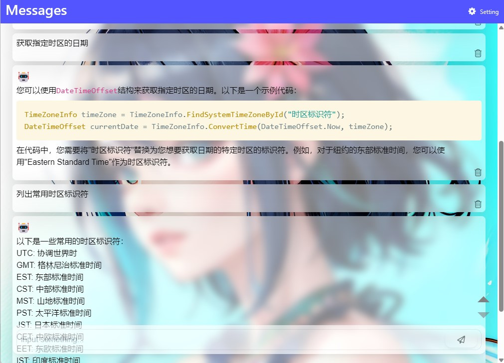

# AquaChat
A simple OpenAI client developed using MAUI.   
The tested platforms are Windows (10+) and Android (12+).   
iOS and Mac may also work, but due to the buggy nature of MAUI, there could be various issues.   
It was a self-use project developed last year, and I originally intended to release it.   
However, upgrading to .NET 8 previously caused the Android controls to not display properly, emmmmm. I recently fixed it, so I plan to release it (although it's not very useful).   
The MAUI version has been upgraded to the latest (8.0.14).  

使用maui开发的简单的openai客户端.  
经测试的平台有windows(10+)和安卓(12+).  
iOS和Mac可能也可以,但是基于maui的bug体质可能会有个各种各样的问题.  

去年开发自用的项目,本来就想放出来.  
但之前升级.NET8导致安卓控件无法显示,emmmmm,最近修复了下就打算放出来(虽然没什么用).  
maui版本已经升级到当前最新(8.0.14)

## Android

## Windows
  

## How to compile/install?
如何编译/安装   
参考微软的maui文档:  
[https://learn.microsoft.com/en-us/dotnet/maui/get-started/installation?view=net-maui-8.0&tabs=vswin](https://learn.microsoft.com/en-us/dotnet/maui/get-started/installation?view=net-maui-8.0&tabs=vswin)  
不需要特殊的配置

windows下msix包安装:  
[https://learn.microsoft.com/en-us/dotnet/maui/windows/deployment/publish-cli?view=net-maui-8.0#installing-the-app](https://learn.microsoft.com/en-us/dotnet/maui/windows/deployment/publish-cli?view=net-maui-8.0#installing-the-app)  

## Framework/lib list
- [MAUI](https://github.com/dotnet/maui)  
- [blazor](https://dotnet.microsoft.com/en-us/apps/aspnet/web-apps/blazor)  
- [prism](https://prismjs.com): 聊天的代码块高亮(code highlighter)
- [markdig](https://github.com/xoofx/markdig)  
- [semantic-kernel](https://github.com/microsoft/semantic-kernel): I should replace it with an openai client lib...no advanced features are used.

## Image
The app's icon and background images were generated using Stable Diffusion, with the [GhostMix](https://civitai.com/models/36520/ghostmix) model and [colorwater](https://civitai.com/models/16055/colorwater) lora.